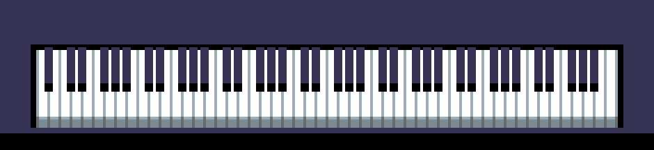
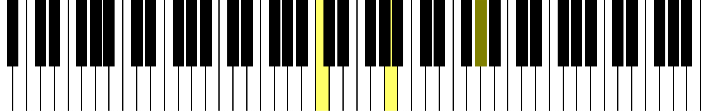

# MIDI Piano

This demo shows how to use
[InputEventMIDI](https://docs.godotengine.org/en/latest/classes/class_inputeventmidi.html)
by creating a piano that can be controlled by a MIDI device.
This is known to work with a `Yamaha MX88` as well as a `Casio Privia PX-160`.

The piano can also be controlled by clicking on the keys, or by
manually calling the activate and deactivate methods on each key.

Note that MIDI output is not yet supported in Godot, only input works.

Language: GDScript

Renderer: GLES 2

Check out this demo on the asset library: https://godotengine.org/asset-library/asset/1292

## Screenshots

